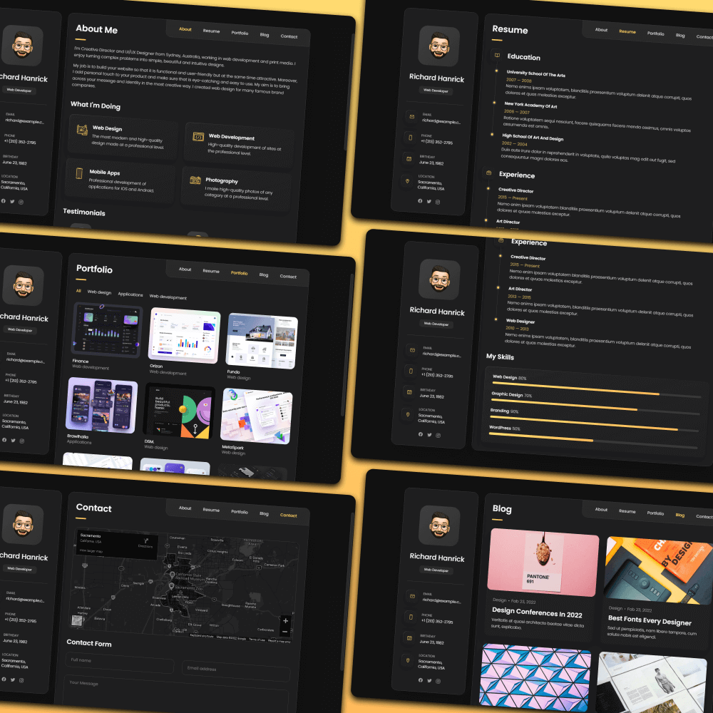
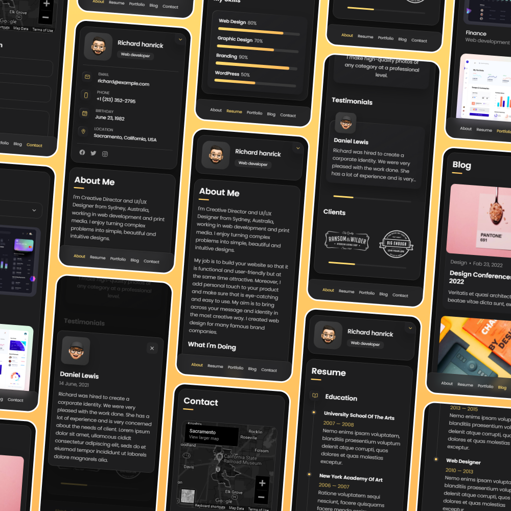

# Brian Personal Portfolio


<!-- [](https://twitter.com/intent/follow?screen_name=codewithsadee_) -->

This is a fully responsive personal portfolio website, responsive for all devices, built using HTML, CSS, and JavaScript.

## Demo




## Prerequisites

Before you begin, ensure you have met the following requirements:

* [Git](https://git-scm.com/downloads "Download Git") must be installed on your operating system.

## Installing vCard

To install **vCard**, follow these steps:

Linux and macOS:

```bash
sudo git clone https://github.com/BrianWangila/brian-personal-portfolio.git
```

Windows:

```bash
git clone https://github.com/BrianWangila/brian-personal-portfolio.git
```

## Contact

<!-- If you want to contact me you can reach me at [Twitter](https://www.twitter.com/codewithsadee). -->

## License

MIT
